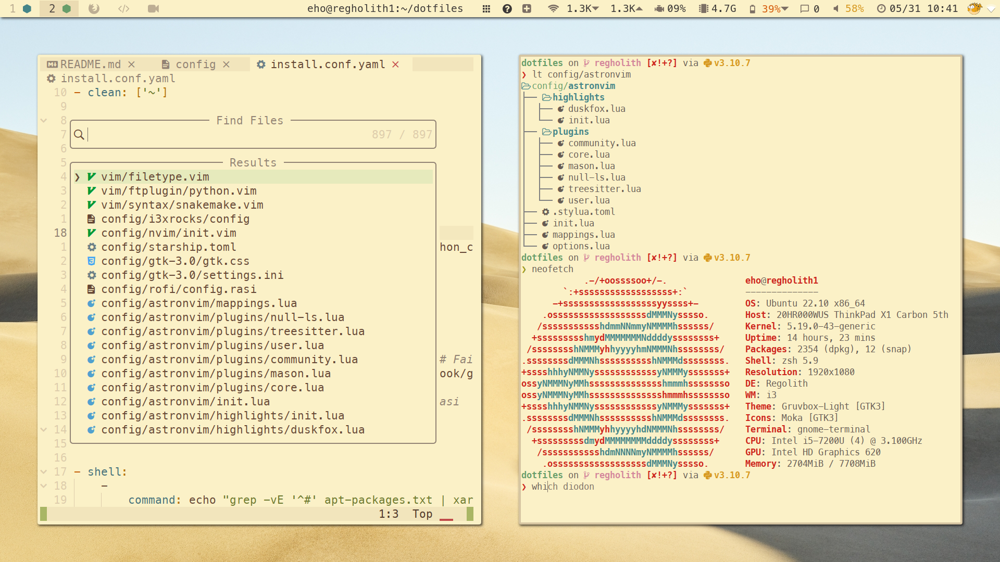

# Ethan's Dotfiles

This repository contains Ethan's `$HOME` configuration for:

1. Mac OS 11.x (branch `mbp`) 
2. Manjaro i3 (`manjarho`)
3. TACC HPC (`tacc-hpc`)
4. TACC HPC lightweight (`tacc-ltwt`)

**Highlights**

* Mac OS
	* [yabai](https://github.com/koekeishiya/yabai) and [skhd](https://github.com/koekeishiya/skhd) for WM
	* [simple-bar](https://github.com/Jean-Tinland/simple-bar) status bar running in Übersicht
	* [Wallpaper](https://images.wallpaperscraft.com/image/leaves_plant_green_136320_3840x2160.jpg)
* Shell
	* zsh with [oh-my-zsh](https://github.com/ohmyzsh/ohmyzsh) and [p10k](https://github.com/romkatv/powerlevel10k.git)
	* Lightweight vim config with [vim-plug](https://github.com/junegunn/vim-plug.git) and [coc.nvim](https://github.com/neoclide/coc.nvim)
	* Vim keybinds whenever possible: zsh, bash, readline, and [even Chrome/Firefox](https://github.com/philc/vimium)
	* Gruvbox for [vim](https://github.com/morhetz/gruvbox) and [iTerm2](https://github.com/herrbischoff/iterm2-gruvbox)
	* [dotbot](https://github.com/anishathalye/dotbot) for one-button installation
	* Lightweight configs for TACC HPC systems, where memory on shared login nodes is sacred



## Installation

1. Clone this repository and, recursively, all submodules:

```bash
git clone --recurse-submodules https://github.com/eho-tacc/dotfiles
```

2. `git fetch --all` and `git checkout` the branch with the desired config.

3. Run the [dotbot](https://github.com/anishathalye/dotbot) install script:

```bash
dotfiles/install.sh
```

3. Remove files in `$HOME` that were not replaced with symlinks, and re-run the install script.

## Reference

### How to save list of installed Atom packages

From [this StackOverflow post](https://stackoverflow.com/questions/30006827/how-to-save-atom-editor-config-and-list-of-packages-installed):
```bash
apm list --installed --bare > ~/.atom/package.list
apm install --packages-file ~/.atom/package.list
```

### How to remove a git submodule

From [myusuf3's Gist](https://gist.github.com/myusuf3/7f645819ded92bda6677):

To remove a submodule you need to:

* Delete the relevant section from the .gitmodules file.
* Stage the .gitmodules changes git add .gitmodules
* Delete the relevant section from .git/config.
* Run `git rm --cached path_to_submodule` (no trailing slash).
* Run `rm -rf .git/modules/path_to_submodule` (no trailing slash).
* Commit `git commit -m "Removed submodule"`
* Delete the now untracked submodule files `rm -rf path_to_submodule`
