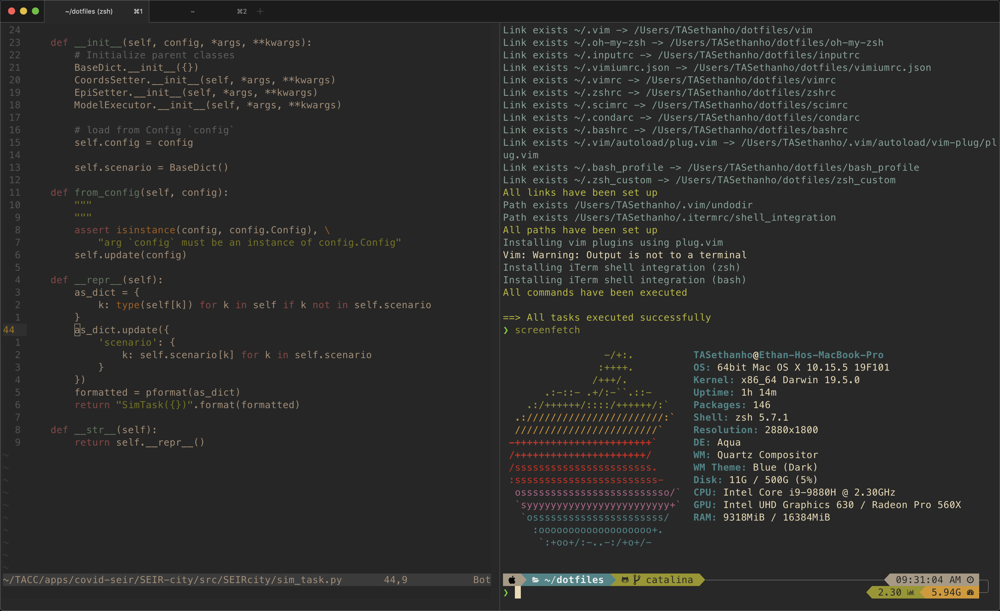

# Ethan's Dotfiles

This repository contains Ethan's `$HOME` configuration on MacBook Pro and TACC HPC systems.

**Highlights**
* zsh with [oh-my-zsh](https://github.com/ohmyzsh/ohmyzsh) and [p10k](https://github.com/romkatv/powerlevel10k.git)
* Lightweight vim config with [vim-plug](https://github.com/junegunn/vim-plug.git) and [YCM](https://github.com/ycm-core/YouCompleteMe)
* Vim keybinds whenever possible: zsh, bash, readline, and [even Chrome](https://github.com/philc/vimium)
* Gruvbox for [vim](https://github.com/morhetz/gruvbox) and [iTerm2](https://github.com/herrbischoff/iterm2-gruvbox)
* [dotbot](https://github.com/anishathalye/dotbot) for one-button installation
* Lightweight configs for TACC HPC systems, where memory on shared login nodes is sacred



## Quick Start

1. Clone this repository and, recursively, all submodules:

```bash
git clone --recurse-submodules https://github.com/ethan-n-ho/dotfiles
```

2. `git checkout` the branch with the desired config.

3. Run the [dotbot](https://github.com/anishathalye/dotbot) install script:

```bash
dotfiles/install.sh
```

3. Remove files in `$HOME` that were not replaced with symlinks, and re-run the install script.

## Reference

### How to remove a git submodule

From [myusuf3's Gist](https://gist.github.com/myusuf3/7f645819ded92bda6677):

To remove a submodule you need to:

* Delete the relevant section from the .gitmodules file.
* Stage the .gitmodules changes git add .gitmodules
* Delete the relevant section from .git/config.
* Run `git rm --cached path_to_submodule` (no trailing slash).
* Run `rm -rf .git/modules/path_to_submodule` (no trailing slash).
* Commit `git commit -m "Removed submodule"`
* Delete the now untracked submodule files `rm -rf path_to_submodule`
